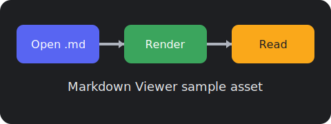

# Markdown Viewer Sample

This sample file exercises headings, lists, tables, code blocks, and embedded images.

## Features

- Clean dark-mode reading experience
- Drag and drop `.md` files
- Zoom with `Ctrl + mouse wheel`
- Windows file association support

## Lists

1. Open from Explorer
2. Use **Open with** → Markdown Viewer
3. Optionally set as the default Markdown app

- Bullet one
- Bullet two
- Bullet three

## Table

| Feature | Status |
| --- | --- |
| Headings | Supported |
| Tables | Supported |
| Code blocks | Supported |
| Images | Supported |

## Code

```ts
function greet(name: string) {
  return `Hello, ${name}!`;
}
```

## Embedded image



## Blockquote

> A lightweight native-feeling viewer for Markdown on Windows.